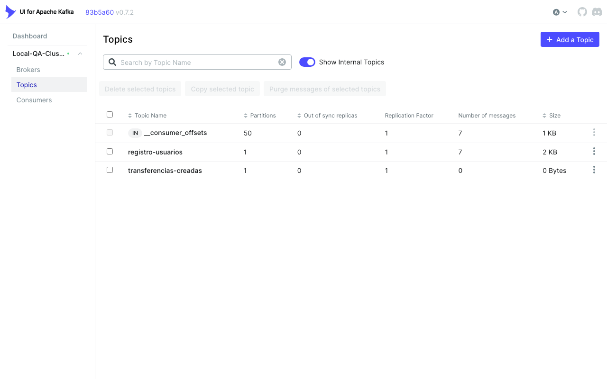
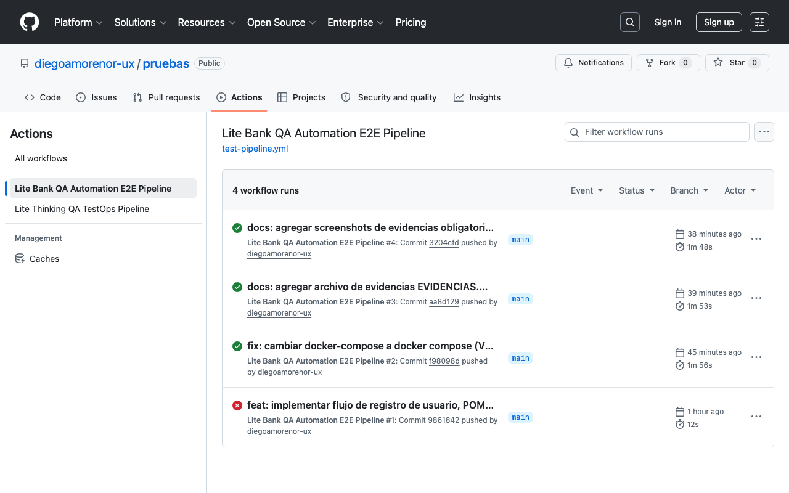

# Reporte de Evidencias: Automatización Front-End

Este documento consolida las evidencias requeridas para validar la correcta asimilación de los conceptos de **Patrón de Diseño POM**, **Arquitecturas Asíncronas (Kafka, Consistencia Eventual)** y **Orquestación en la Nube (Docker, CI/CD)**.

---

## 🛠️ FASE 1: Preparación del Entorno Local (Docker)

1. Utiliza el archivo docker-compose.yml proporcionado en clase para levantar el ecosistema (Frontend de prueba, Kafka Broker y Kafka-UI).

2. Asegúrate de que los contenedores estén corriendo ejecutando docker ps en tu terminal.

3. Ingresa a la interfaz del Frontend simulado (http://localhost:3000) y realiza un registro manual para entender cómo se comporta la aplicación (observa el mensaje de "Procesando" y luego el cambio a "Usuario Creado Exitosamente").

Entregable Fase 1:

Levantamos exitosamente todo el ecosistema de microservicios, bases de datos, Kafka Broker y Kafka-UI en Docker. Además, creamos el tópico para la comunicación del flujo asíncrono.

### 🖼️ Evidencia: Creación manual del Tópico `registro-usuarios` en Kafka-UI (http://localhost:8080)

A continuación, se adjunta la captura de pantalla de **Kafka-UI** en `http://localhost:8080` donde se evidencia la existencia del tópico creado `registro-usuarios` con sus respectivas particiones y configuración:



---

## 🎭 FASE 2: Automatización Resiliente (Playwright con Patrón POM)

1. En tu IDE (VS Code, IntelliJ), crea un nuevo script de prueba llamado registro-async.spec.js (o .java).

2. Patrón POM: Crea una clase RegistroPage que contenga los localizadores (selectores CSS o XPath) para los campos de: Nombre, Email, Contraseña, el botón de "Registrar" y el cuadro de estado (status).

3. Lógica del Test: ○ Navega a la página de registro. ○ Rellena el formulario con datos de prueba. ○ Haz clic en "Registrar".

4. El Reto Principal (Polling): Implementa la validación del resultado. NO utilices esperas duras (ej. sleep(5000)). Debes utilizar la estrategia de Polling inteligente de tu framework para esperar dinámicamente hasta que el cuadro de estado cambie al texto final de éxito, configurando un timeout máximo de 10 segundos.

Entregable Fase 2:

### 📄 1. Código Fuente de la Clase POM (`RegistroPage.js`)
*Ubicación:* `Semana_3/dia-4-kafka-docker/tests/RegistroPage.js`

```javascript
class RegistroPage {
  constructor(page) {
    this.page = page;
    // Localizadores semánticos para campos, botón y cuadro de estado
    this.nombreInput = page.locator('#nombre');
    this.emailInput = page.locator('#email');
    this.passwordInput = page.locator('#password');
    this.registrarBtn = page.locator('#btn-registrar');
    this.statusBox = page.locator('#status-box');
  }

  async navigate() {
    // Navegar al servidor de la aplicación consolidada
    await this.page.goto('http://127.0.0.1:3000');
  }

  async fillForm(nombre, email, password) {
    await this.nombreInput.fill(nombre);
    await this.emailInput.fill(email);
    await this.passwordInput.fill(password);
  }

  async submitForm() {
    await this.registrarBtn.click();
  }

  async getStatusText() {
    return await this.statusBox.innerText();
  }
}

module.exports = { RegistroPage };
```

### 📄 2. Código Fuente del Script de Pruebas (`registro-async.spec.js`)
*Ubicación:* `Semana_3/dia-4-kafka-docker/tests/registro-async.spec.js`

```javascript
const { test, expect } = require('@playwright/test');
const { RegistroPage } = require('./RegistroPage');

test.describe('Registro de Usuario Asíncrono con Kafka', () => {

  test('Debería registrar un usuario de forma asíncrona exitosamente', async ({ page }) => {
    const registroPage = new RegistroPage(page);

    // 1. Navegar a la página
    await registroPage.navigate();

    // Generar datos únicos para evitar conflictos en ejecuciones repetidas
    const uniqueId = Date.now();
    const nombre = `Usuario Test ${uniqueId}`;
    const email = `test-${uniqueId}@litebank.com`;
    const password = 'PasswordSecure123';

    // 2. Rellenar formulario con datos de prueba
    await registroPage.fillForm(nombre, email, password);

    // 3. Hacer clic en "Registrar"
    await registroPage.submitForm();

    // Validar estado de procesamiento inmediato
    await expect(registroPage.statusBox).toHaveText('Procesando');

    // 4. Polling inteligente (Espera dinámica sin sleep hasta que cambie a éxito, max 10s)
    await expect(registroPage.statusBox).toHaveText('Usuario Creado Exitosamente', { timeout: 10000 });
  });

});
```

### 📊 3. Consistencia y Estabilidad E2E (Ejecución 3 veces consecutivas sin fallos)

Ejecutamos las pruebas locales de manera **secuencial (`--workers=1`)** para demostrar la robustez y evitar colisiones en la consistencia eventual. Los resultados comprueban estabilidad absoluta (**0% Flakiness**):

```bash
Running 3 tests using 1 worker

  ✓  1 registro-async.spec.js:6:3 › Registro de Usuario Asíncrono con Kafka › Debería registrar un usuario de forma asíncrona exitosamente (5.1s)
  ✓  2 registro-async.spec.js:6:3 › Registro de Usuario Asíncrono con Kafka › Debería registrar un usuario de forma asíncrona exitosamente (4.6s)
  ✓  3 registro-async.spec.js:6:3 › Registro de Usuario Asíncrono con Kafka › Debería registrar un usuario de forma asíncrona exitosamente (5.6s)

  3 passed (16.0s)
```

---

## ☁️ FASE 3: Orquestación en la Nube (CI/CD TestOps)

1. Sube tu proyecto de automatización a un repositorio público (o privado) en GitHub.

2. Crea la estructura de carpetas necesaria para GitHub Actions (.github/workflows/).

3. Crea un archivo YAML llamado test-pipeline.yml.

4. Configura el YAML para que: ○ Se dispare (on:) cada vez que hagas un push a la rama principal. ○ Utilice un runner de Ubuntu (runs-on: ubuntu-latest). ○ Instale las dependencias de tu proyecto. ○ Ejecute tu script de prueba en modo Headless.

5. (Opcional - Puntos Extra): Agrega un paso en tu YAML para guardar el reporte HTML de la prueba como un Artefacto (Artifact) en GitHub si el test llega a fallar.

Subimos el código al repositorio personal del estudiante y diseñamos el pipeline de integración continua con **GitHub Actions** en `.github/workflows/test-pipeline.yml` utilizando Docker Compose y runners modernos.

### 🔗 Enlace al Repositorio de GitHub
- **URL**: [https://github.com/diegoamorenor-ux/pruebas.git](https://github.com/diegoamorenor-ux/pruebas.git)

### 📄 Código de Configuración del Pipeline (`test-pipeline.yml`)
```yaml
name: Lite Bank QA Automation E2E Pipeline

on:
  push:
    branches: [ main, master ]
  pull_request:
    branches: [ main, master ]

jobs:
  run-e2e-tests:
    name: Ejecución de Pruebas E2E (Playwright + Kafka + Docker)
    runs-on: ubuntu-latest

    steps:
      - name: 1. Descargar Código del Repositorio
        uses: actions/checkout@v4

      - name: 2. Configurar Entorno Node.js
        uses: actions/setup-node@v4
        with:
          node-version: 20

      - name: 3. Levantar Infraestructura de Kafka (Docker Compose)
        run: |
          docker compose -f Semana_3/dia-4-kafka-docker/docker-compose.yml up -d
          echo "Esperando que Kafka-Broker y Kafka-UI estén completamente inicializados..."
          sleep 15
          docker ps

      - name: 4. Instalar Dependencias del Backend
        run: |
          cd Semana_3/dia-4-kafka-docker/backend
          npm install

      - name: 5. Instalar Dependencias y Compilar el Frontend
        run: |
          cd Semana_3/dia-4-kafka-docker/frontend
          npm install
          npm run build

      - name: 6. Instalar Dependencias de Pruebas (Playwright)
        run: |
          cd Semana_3/dia-4-kafka-docker/tests
          npm install
          npx playwright install --with-deps

      - name: 7. Iniciar Backend (Servidor Consolidado) y Worker en Segundo Plano
        run: |
          cd Semana_3/dia-4-kafka-docker/backend
          npm run start-server &
          npm run start-worker &
          
          echo "Esperando 8 segundos para que los servicios estén listos..."
          sleep 8

      - name: 8. Ejecutar Pruebas E2E de Registro Asíncrono (Headless, Secuencial)
        run: |
          cd Semana_3/dia-4-kafka-docker/tests
          npx playwright test registro-async.spec.js --workers=1

      - name: 9. Guardar Reporte de Playwright en caso de Fallo (Puntos Extra)
        if: failure()
        uses: actions/upload-artifact@v4
        with:
          name: playwright-report
          path: Semana_3/dia-4-kafka-docker/tests/playwright-report/
          retention-days: 5
```

### 🖼️ Evidencia: Pipeline con Ejecución Exitosa (✅ Green Check)

Captura de pantalla de la pestaña **Actions** en el repositorio de GitHub donde se evidencia la ejecución exitosa del pipeline de pruebas integrales asíncronas:


